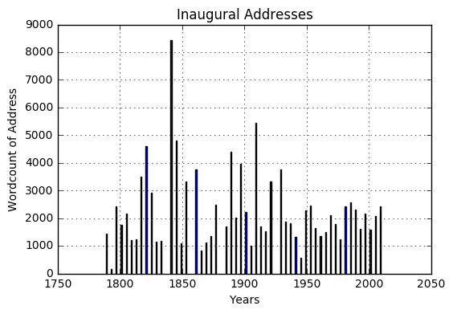

# An Experiment: Soup to Nuts

Presidential addresses have drawn attention of historians and other scholars for years. In addition to scholars who focus on indiviual presidents' inaugural speeches as texts fit for close reading, a good many scholars have viewed the inaugural address as a kind of genre, and they have analyzed _all_ inaugural addresses as a group. Treating the inaugural addresses as a corpus, some have explored questions about "civil religion," or discourses of nationalism, as they are expressed in the presidents' speeches [@toolin_american_1983]. Others have focused attention on rhetorical commonalities in the inaugural addresses, finding similar rhetorical "moves" in the speeches across time [@mcdiarmid_presidential_1937, @fulmer_rhetoric_1986]. Methodolgically, much of this work has relied on tools such as "content analysis," a laborious and justly-critiqued method of manual keyword counting [@toolin_american_1983]. Recently, scholars have begun to use tools of computational text analysis to explore the inaugural addresses algorithmically [@whissell_times_2001]. My project was inspired by a desire to apply new methods of machine learning to the corpus of inaugural addresses. As a historian, I have been impressed at the applications of these new techniques for distant reading in literature, such as in the study of literary genre over time. I wondered whether machine learning techniques-- especially the use of classifiers and other supervised learning techniques, or unsupervised learning techniques like clustering-- could be applied to a "historical" data-set like the inaugural addresses to yield interesting results [^1]. I was especially interested in whether exploratory data analysis could provide 'objects' for interpretation-- models and coefficients that might prompt interesting historical questions about difference, similarity and pattern in historical data. As a historian, perhaps my biggest interpretive interest was in seeing whether I could apply some of these methods to suss out the historian's most important quarry: novel understandings (or simple observations) of change over time. 

[^1]: This work was performed for Ted Underwood's course _Data Science in the Humanities_, taught in the Spring semester of 2017 at GSLIS. I am grateful to Ted for letting me take this course and for helping me see how some of these new methods might apply to historical questions and datasets.

As I mentioned during my in-class presentation of my work, my priority in this final project was to try to employ several of the new tools in my EDA and machine learning toolkit. But I also wanted to practice a "soup to nuts" project design and execution. I take to heart-- and I know from experience-- that none of the machine learning methods are really worth much to somebody who has no useful datasets. A week prior to beginning the Spring 2017 semester, I happened on a new article by Andrew Goldstone about the challenges of teaching quantitative methods in the humanities [@goldstone_teaching_nodate]. One of Goldstone's central reflections about teaching this material to humanities students and scholars is that datasets are often a central problem. Even the most dedicated would-be digital humanist needs to have a good dataset or two. At the same time, it is pretty worthless if digital humanists confine themselves to questions that can be answered by querying the same handful of ready-made datasets that are available to researchers thanks to a library investment, a handy API, or some other unusual circumstance. After all, if I only gravitate towards those datasets that already exist, my research will by necessity be driven not by my intellectual questions, but rather by a more opportunistic consideration of what questions can likely be answered by the data at hand. Of course this is a dilemma that we always face in the discipline of history, even when we practice it in a completely analog fashion. But reflecting on this dilemma as it pertains to digital history, I decided that I would dedicate myself to creating (or at least finding) a new dataset for analysis. To the extent that digital humanists are joining the world of "makers," it is probably just as important that we learn to "make" our datasets as it is that we learn to make some kind of code or app. Of course, I know for the purposes of this project that this commitment on my part involves a tradeoff; one of Ted's syllabus entries for the week on data munging promised that munging data was "90% of the work," so I knew that deciding to create a dataset by myself would leave me less time for interesting visualizations and analysis. Still, I decided that if I spent 90% of my work time in this project getting a dataset ready for analysis, I could live with that, as long as I succeeded in creating a dataset to which I could in the end apply the methods like dunnings or bayes. 

In this connection, there's one more reflection that I want to make by way of introduction. This is a project where the technical cart is pulling the intellectual horse, so to speak. Despite the fact that I dedicated myself to munging a dataset and doing this work soup to nuts, I still had to pick my topic based on what I knew about scrapable clean texts online, and that left me with only a few options (that I could think of) for a group of texts that could constitute corpora for analysis with the tools that we have learned and with the web-scraping and parsing techniques that I know so far. In other words, I view my "big data" historical work as a work in progress, to be realized in the future if ever. For now, I understand and accept my limitations. The good news is that I still find this fun even if it does not result in publishable work! Obviously at some point this will likely change, but for now, a project like this is just fine for me, despite its obvious weaknesses, and the fact that it is less a question-driven investigation and more a skills-driven proof of concept.

# Trial and Error: Munging

Since I was especially interested in classifiers, I began my work searching for data (i.e. digitized texts) for which an obvious problem was their comparability, or their differentiation from one another. I initially wanted to work with pamphlets from the AMerican REvolution, examining the extent to which pamphlets published in Britain were distinguishable from those published in the colonies, as well as the question of when that distinction became pronounced. Unfortunately, I could find no way to get a good corpus of texts for this purpose, and I abandoned it.

My next idea was to use the JSTOR API to examine historiography through machine learning in five historical journals over the last 25 years or so. I planned to use algorithms to examine article abstracts or even titles and see whether a method like bayes or another machine learning model could successfully classify abstracts from particular journals, or from particular periods of time. My thought was that the classifiers probably would fail to distinguish journals from one another, but might succeed at distinguishing decades, or perhaps subjects. If this proved true, and if then I could group my dataframes into decadal or 5-year subsets, perhaps I could notice a differential over time or journal in the models' or algorithms' ability to distinguish the data which might tell me something interesting about scholarly conversations over time. Unfortunately, this project never got off the ground. I requested datasets from the JSTOR [Data For Research](www.dfr.jstor.org/) site, and received the nearly 5000 records that JSTOR allows researchers to request. I began writing code to munge the xml and json files for one of the journals I was examining. Unfortunately, after succeeding in my efforts to parse the xml files for the _William and Mary Quarterly_, I realized that the file structure for the other journals in my corpus was slightly different, and so was the xml format for the citations. As a result, I could not-- as I had hoped I could-- apply my functions to the rest of the corpus to create a giant (n= 5000) dataframe. After banging my head against the wall for a while, I gave up. The good news is I now know how I can use the xml files from jstor much more efficiently, and I solved a few parsing challenges (such as how to deal with multiple authors while looping through an xml tree and parsing data into lists for a dataframe). But in the end I realized that the jstor data was going to be too much work for my time constraints with this project. 

My fallback was the inaugural addresses. In contrast to the historiography problem that I started with, my investigation into the inaugural addresses did not start with even the most general historical question; this was _extremely_ exploratory data analysis. But if I did not have a question, I knew intuitively that there might be a way to apply the classifier and clustering techniques to the inaugural addresses just to see what would happen. I knew that the dataset was very small-- just shy of 60 texts. But I also knew that the munging and the parsing for this dataset would be satisfying and at the same time feasible. I decided that I could explore distinctions in party and use the algorithms to see if the presidents' party affiliations would be reflected in a rhetorical or semantic distinction that the classifiers could pick up. If so, I wondered if that dinstinction increased over time, or was greater in one era than another. Even with a small dataset, I wondered if some of these issues could be explored. Furthermore, I wondered if a similar distinction was detectable between presidents who were "party incumbents"-- i.e. entering the White House on the heels of a previous president from their own political party-- and "party newcomers." In the end, I was not able to execute the change over time dimension of the analysis, but I came to certain (although not surprising or significant, as we will see) answers on the rest of these questions. 

# Munging Process

My munging process was, as predicted, the lion's share of the work I performed on this project. I got the bulk of my data by scraping the inaugural addresses and other metadata from the [Yale Avalon Project](http://avalon.law.yale.edu/). You can see my munging in the attached jupyter notebook or in the one posted at [GitHub](https://github.com/historybman/EADA/blob/master/Inaugural_Munging.ipynb). The two biggest technical challenges in this part of the work were:

- First, I scraped the texts from a table at the Avalon project, using BeautifulSoup. Parsing the html links and years was no trouble, and I wound up with two lists for year and urls leading to the actual texts. The problem was when I went to create a list of presidents-- I could not figure out how to duplicate multi-year president's names. For instance, I needed FDR to appear in the list four times to match his four inaugural addresses. I had to hand code. 
- Secondly, I spent a long time trying to get all the texts in programatically, but some of them had to be added after the fact, by hand. 

The rest of the munging was pretty straightforward; I had a struggle removing some of the extraneous words that did not come out with my function to remove header and footers. I wrote some functions to count the words in the texts, which incidentally gave me a pretty nice little picture:

# Analysis

# Conclusion

My final project for Data Science for the Humanities was ultimately not successful at producing a significant finding or what I would consider a noteworty conclusion. Nobody would be surprised to know that a machine learning project did not distinguish the content, semantics, or rhetoric of inaugural addresses on the basis of political party of incumbency-- there are too many other variables that affected the content of inaugural addresses, including a long sweep of time during which language changed, idiom changed, and etc. The project was not well-designed to yield a significant result. 

And yet, there are some interesting things that we can say about the non-result. The _failure_ of the algorithms to distinguish REpublican from Democratic inaugural addresses probably does reflect how much the ideologies of "Democratic" and "Republican" parties have changed oveer time. The 19th century Republicans were the liberals on many social questions, and that lasted right up until the Civil Rights movement and arguably Nixon. 